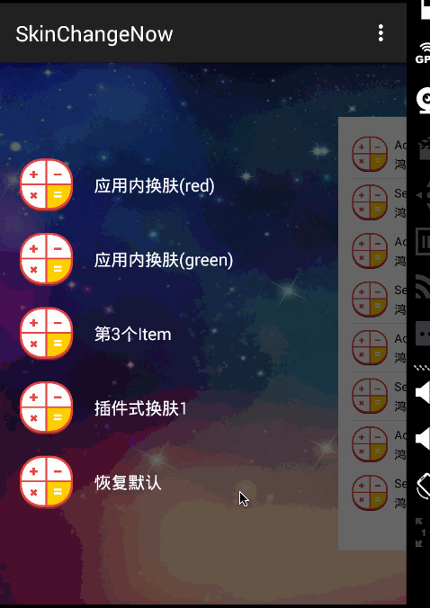

# AndroidChangeSkin
一种完全无侵入的换肤方式，支持插件式和应用内，无需重启Activity.

与之前发布的ChangeSkin思路完全不同[https://github.com/hongyangAndroid/ChangeSkin](https://github.com/hongyangAndroid/ChangeSkin)，主要因为ChangeSkin依赖V4，V7的版本，以及干涉系统构造View的过程，于是希望找到一个几乎没有侵入的方式来实现，于是产生了AndroidChangeSkin，两个项目各有特点，目前两个项目代码都保留，欢迎试用与反馈。


## 特点
* 插件式换肤
* 应用内换肤
* 支持插件或者应用内多套皮肤
* 支持动态生成addView
* 无需重启Activity


## 效果图：



## 引入

下载changeskin，作为module依赖至主项目，例如：

```xml
dependencies {
     compile project(':changeskin')
}
```
或者直接添加依赖：

```xml
dependencies {
    compile 'com.zhy:changeskin:4.0.2'
}
```

## 运行

Android Studio，import Project形式导入，将[skin_plugin.apk](skin_plugin.apk)，放置到模拟器或者真机的sdcard根目录，然后运行项目。

## 使用

* Application

Application中去调用`SkinManager.getInstance().init(this);`，未来版本可能会去除该步骤。


```java
public class MyApplication extends Application
{
    @Override
    public void onCreate()
    {
        super.onCreate();
        SkinManager.getInstance().init(this);
    }
}

```

* Activity

在需要换肤的Activity的onCreate和onDestory中，分别：

```java

@Override
protected void onCreate(Bundle savedInstanceState)
{ 
    SkinManager.getInstance().register(this);
    //...
}

@Override
protected void onDestroy()
{
    super.onDestroy();
    SkinManager.getInstance().unregister(this);
}
```

* 布局文件

布局文件中添加支持，主要依赖于tag属性：

例如：

```xml
 <TextView
        android:layout_width="wrap_content"
        android:layout_height="wrap_content"
        android:tag="skin:item_text_color:textColor"
        android:text="@string/hello_world"
        android:textColor="@color/item_text_color"/>
```

tag属性分为3部分组成：
 
 * skin
 * 资源的名称，即插件包中资源的名称，需要与当前app内使用的资源名称一致。
 * 支持的属性，目前支持src,background,textColor,支持扩展。

3部分，必须以:分隔拼接。

对于一个View多个属性需要换肤的，`android:tag="skin:item_text_color:textColor|skin:icon:src"`
同样使用|进行分隔。

简言之：如果你哪个View需要换肤，就添加tag属性，tag值按照上述方式设置即可。


* 换肤的API

插件式：

```java
SkinManager.getInstance().changeSkin(
	mSkinPkgPath, 
	"com.imooc.skin_plugin", 
	new ISkinChangingCallback()
    {
        @Override
        public void onStart()
        {
        }

        @Override
        public void onError(Exception e)
        {
            Toast.makeText(MainActivity.this, "换肤失败", Toast.LENGTH_SHORT).show();
        }

        @Override
        public void onComplete()
        {
            Toast.makeText(MainActivity.this, "换肤成功", Toast.LENGTH_SHORT).show();
        }
    });
```

应用内：

```java
SkinManager.getInstance().changeSkin(suffix);
```
应用内多套皮肤以后缀就行区别，比如：main\_bg，皮肤资源可以为：main\_bg\_red,main\_bg\_green等。

换肤时，直接传入后缀，例如上面描述的red,green。


 